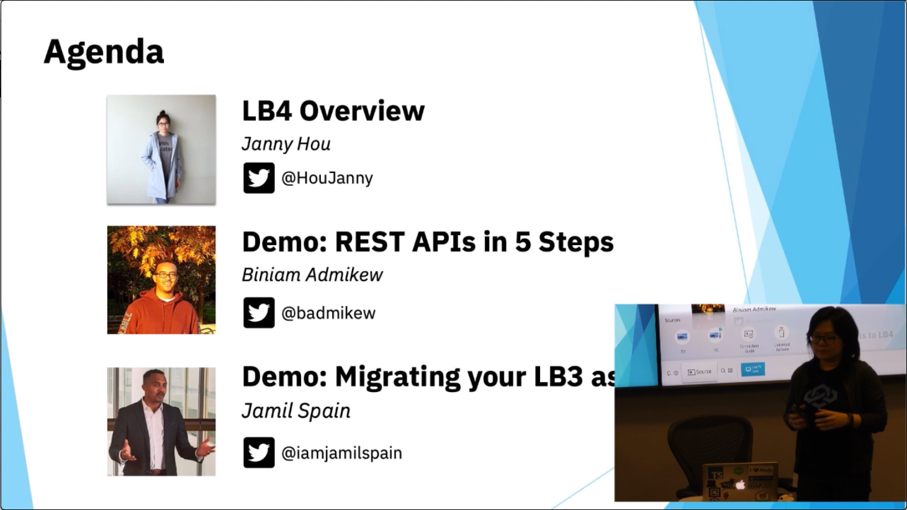

_Originally published on [strongloop.com](https://strongloop.com)_

The Toronto Cloud Integration Meetup hosted an event on Tuesday, February 5, 2019: "Quickly Build APIs with Existing Services and Data Using LoopBack!" Since not everyone is local, we filmed the meetup so we could share it with our community.

<!--truncate-->

Our goal was to bring awareness of LoopBack to the Node.js community in Toronto. We also brought snacks and swag to share. Here's a snapshot of what was covered.

- [Janny Hou](https://twitter.com/houjanny) explained what LoopBack is, what you can do with it, and the rationale behind the rewrite of the framework. You can find the link to relevant LB4 docs [here](https://loopback.io/doc/en/lb4/).

- [Biniam Admikew](https://twitter.com/badmikew) demonstrated how how easy it is to expose REST API from your database with just a few steps.  

- [Jamil Spain](https://twitter.com/iamjamilspain) provided an additional demo while also taking care of capturing the meetup on video. 

You can view each videos on our YouTube channel playlist [here](https://www.youtube.com/playlist?list=PL2I5I38o2kSCPCIxd8IjzYAMZnxcy3BYo).

You can view the slides from the meetup on [Slideshare](https://www.slideshare.net/DaveWhiteley1/2019-02-05-toronto-cloud-integration-meetup).

## What's Next?

- Visit the [LoopBack 4 GithHub page](https://github.com/strongloop/loopback-next/) to contribute! 
